# � Hệ thống Tìm kiếm Video (CBVR) - Late Fusion & U^2-Net

Hệ thống Tìm kiếm Video dựa trên Nội dung (Content-Based Video Retrieval) tối ưu cho phần cứng giới hạn (8GB RAM). Hệ thống kết hợp 4 đặc trưng đa phương thức và kỹ thuật bóc tách n�n bằng AI (U^2-Net) để đạt độ chính xác cao nhất trên tập dữ liệu �ộng vật.

## ✨ Sơ đồ khối Kiến trúc Hệ thống

*(Nếu bạn đang xem trên GitHub, sơ đồ dưới đây sẽ tự động hiển thị rất trực quan)*

```mermaid
flowchart TD
    %% --- KHAI B�O C�C CỤM (SUBGRAPHS) ---
    subgraph Phase1 ["Phase 1 & 1.5: Xử lý Dữ liệu thô (Data Pipeline)"]
        direction TB
        V[Kho Video Gốc .mp4] -->|TransNetV2| SBD[Cắt Cảnh/Shot Boundary Detection]
        SBD --> KFE[Trích xuất Keyframes]
        KFE -->|Resize & Padding| F1[(data/frames/\nẢnh 512x512)]
        F1 -->|rembg| U2[Trí tuệ nhân tạo U^2-Net\nBóc tách Background]
        U2 --> M1[(data/masks/\nẢnh n�n đen sắc nét)]
    end

    subgraph Phase2 ["Phase 2: Xây dựng CSDL (Database Building)"]
        direction TB
        M1 --> FE1{Feature Extractor\nLoại b� hoàn toàn điểm ảnh �en}
        
        FE1 -->|ViT-B/32| V1[CLIP Vector\nNgữ nghĩa 512-D]
        FE1 -->|Masked Hist| V2[Color Vector\nMàu sắc HSV 512-D]
        FE1 -->|Grayscale| V3[HOG Vector\nHình dáng 3780-D]
        FE1 -->|Masked Uniform| V4[Texture LBP Vector\nKết cấu Lông/Vằn 26-D]
        
        V1 --> F_CLIP[(FAISS CLIP Index)]
        V2 --> F_COL[(FAISS Color Index)]
        V3 --> F_HOG[(FAISS HOG Index)]
        V4 --> F_TEX[(FAISS Texture Index)]
        
        FE1 --> CSV[(mapping.csv\nLÆ°u Metadata Video)]
    end

    subgraph Phase3 ["Phase 3: Giao diện Streamlit & Tìm kiếm (Retrieval)"]
        direction TB
        UI_IN[Ngư�i dùng Upload\nẢnh Truy Vấn] --> U2_QUERY[U^2-Net Ti�n Xử Lý\nXóa Background �ồng bộ]
        U2_QUERY --> FE2{Feature Extractor}
        
        FE2 --> Q_CLIP[Q_CLIP]
        FE2 --> Q_COL[Q_Color]
        FE2 --> Q_HOG[Q_HOG]
        FE2 --> Q_TEX[Q_Texture]
        
        Q_CLIP -->|Inner Product| F_CLIP
        Q_COL -->|Inner Product| F_COL
        Q_HOG -->|Inner Product| F_HOG
        Q_TEX -->|Inner Product| F_TEX
        
        F_CLIP --> S1[Scores CLIP]
        F_COL --> S2[Scores Color]
        F_HOG --> S3[Scores HOG]
        F_TEX --> S4[Scores Texture]
        
        S1 & S2 & S3 & S4 --> LF((Toán h�c\nLATE FUSION))
        LF --> |w1, w2, w3, w4| TOTAL[Total Scores M�i Frame]
        
        TOTAL --> CSV
        CSV --> GRP[Video Grouping\nLấy Frame �iểm Cao Nhất Của Từng Video]
        GRP --> SORT[Sắp xếp Giảm Dần\nLấy Top 5]
        SORT --> UI_OUT[Hiển thị kết quả & �iểm thành phần]
    end

    %% --- LIÊN KẾT GIỮA C�C SUBGRAPH ---
    Phase1 ~~~ Phase2
    Phase2 ~~~ Phase3

    %% --- STYLING MÀU SẮC CHO �ẸP ---
    style Phase1 fill:#f9f2ec,stroke:#e67e22,stroke-width:2px,color:#d35400
    style Phase2 fill:#eaf2f8,stroke:#2980b9,stroke-width:2px,color:#154360
    style Phase3 fill:#e8f8f5,stroke:#1abc9c,stroke-width:2px,color:#0e6251
    style LF fill:#f1c40f,stroke:#f39c12,stroke-width:4px,color:#000
    style FE1 fill:#9b59b6,stroke:#8e44ad,color:#fff
    style FE2 fill:#9b59b6,stroke:#8e44ad,color:#fff
    style U2 fill:#e74c3c,stroke:#c0392b,color:#fff
    style U2_QUERY fill:#e74c3c,stroke:#c0392b,color:#fff
```

## 🚀 Cách thức hoạt động
1. **Phase 1 (`run_phase1_extract_frames.py`)**: Dùng `TransNetV2` để phát hiện chuyển cảnh (Shot Boundary) và trích xuất Keyframe chuẩn 512x512 có vi�n đen.
2. **Phase 1.5 (`run_phase1_5_smart_crop.py`)**: Dùng mạng nơ-ron `U^2-Net` (`rembg`) để bóc tách n�n (background) cực kỳ sắc nét, giữ lại hoàn toàn "thịt" động vật.
3. **Phase 2 (`run_phase2_build_index.py`)**: ��c ảnh đã xóa n�n, sử dụng Mask để **b� qua n�n đen**, tính toán 4 Vector đặc trưng (CLIP, Color, HOG, LBP) và nạp vào CSDL FAISS.
4. **Phase 3 (`app.py`)**: Giao diện Streamlit cho phép upload ảnh. Ảnh cũng được đưa qua `U^2-Net` để đảm bảo tính đồng nhất. Sau đó thuật toán `Late Fusion` và `Video Grouping` sẽ xếp hạng và trả v� 5 Video liên quan nhất.

## 2.1. Ti?n x? lý
Toàn b? video nhóm s? d?ng du?c chu?n hóa v? d?nh d?ng th?ng nh?t:
• Ð?c video t? thu m?c d?u vào, h? tr? các d?nh d?ng .mp4, .avi, .mov, .mkv, .webm
• Trích xu?t khung hình (Keyframe): Video du?c chia thành các shot theo nguyên lý phát hi?n thay d?i c?nh thông qua hai phuong pháp:
  - **Phuong pháp 1 (Uu tiên) - M?ng no-ron TransNetV2**: M?ng h?c sâu d? doán di?m c?t c?nh v?i d? chính xác cao trên t?ng batch (500 frames/l?n).
  - **Phuong pháp 2 (D? phòng) - Bi?u d? màu (Histogram Difference)**: H? th?ng t? d?ng chuy?n sang so sánh kho?ng cách Bhattacharyya gi?a các histogram HSV liên ti?p. N?u d? khác bi?t > 0.4, m?t shot m?i du?c dánh d?u.
• L?c và l?y m?u: B? qua các shot quá ng?n (du?i 15 frame). M?i shot h?p l? s? l?y d?i di?n t?i da 3 keyframes ? các v? trí chia d?u.
• Ti?n x? lý ?nh (Letterboxing): T?t c? các keyframe du?c thu nh? sao cho l?n nh?t không vu?t quá 512 pixel, gi? nguyên t? l? khung hình th?t. Ph?n b? du du?c d?n vi?n den d? t?o ra ?nh vuông chu?n 512x512 giúp t?i uu hóa khi dua vào các m?ng h?c sâu.
• Xóa phông (Smart Cropping): Toàn b? ?nh keyframe 512x512 du?c ch?y qua mô hình **U^2-Net** d? tách n?n t? d?ng. Ph?n c?nh quan du?c bi?n thành màu den tuy?t d?i (pixel=0), tri?t tiêu hoàn toàn s? nhi?u lo?n màu s?c.
